# Entity Relationship Diagram

```mermaid
erDiagram
    PERSON {
        BIGINT id PK
        VARCHAR name
        VARCHAR emailAddress
        VARCHAR phone
        BOOLEAN isActive
    }
    
    GROUP {
        BIGINT id PK
        VARCHAR name
    }
    
    PERSON ||--o{ PERSON_GROUP : "belongs to"
    GROUP ||--o{ PERSON_GROUP : "contains"
    
    PERSON_GROUP {
        BIGINT personId FK
        BIGINT groupId FK
    }
    
    PERMISSION {
        BIGINT id PK
        VARCHAR name
    }
    
    GROUP ||--o{ GROUP_PERMISSION : "has"
    PERMISSION ||--o{ GROUP_PERMISSION : "granted to"
    
    GROUP_PERMISSION {
        BIGINT groupId FK
        BIGINT permissionId FK
    }
    
    NOTE {
        BIGINT id PK
        TEXT value
        TIMESTAMP createdAt
        BIGINT personId FK
    }
    
    PERSON ||--o{ NOTE : "has"
    
    SHIFT_TEMPLATE {
        BIGINT id PK
        VARCHAR name
        INTEGER latestVersion
    }
    
    VERSIONED_SHIFT_TEMPLATE {
        BIGINT id PK
        BIGINT shiftTemplateId FK
        INTEGER version
        VARCHAR displayValue
        BIGINT requiredPermissionId FK
        TIMESTAMP createdAt
        BOOLEAN displayPhone
        BOOLEAN displayEmail
    }
    
    EVENT_PROPERTY_TEMPLATE {
        BIGINT id PK
        VARCHAR name
        INTEGER latestVersion
    }
    
    VERSIONED_EVENT_PROPERTY_TEMPLATE {
        BIGINT id PK
        BIGINT eventPropertyTemplateId FK
        INTEGER version
        VARCHAR displayValue
        VARCHAR defaultValue
        TIMESTAMP createdAt
    }
    
    EVENT_TEMPLATE {
        BIGINT id PK
        VARCHAR name
        INTEGER latestVersion
    }
    
    VERSIONED_EVENT_TEMPLATE {
        BIGINT id PK
        BIGINT eventTemplateId FK
        INTEGER version
        TIMESTAMP createdAt
    }
    
    VERSIONED_EVENT_TEMPLATE_EVENT_PROPERTY_TEMPLATE {
        BIGINT id PK
        BIGINT versionedEventTemplateId FK
        BIGINT versionedEventPropertyTemplateId FK
        INTEGER orderIndex
    }
    
    VERSIONED_EVENT_TEMPLATE_SHIFT_TEMPLATE {
        BIGINT id PK
        BIGINT versionedEventTemplateId FK
        BIGINT versionedShiftTemplateId FK
        INTEGER orderIndex
    }
    
    SHIFT {
        BIGINT id PK
        VARCHAR displayValue
        BIGINT requiredPermissionId FK
        BOOLEAN displayPhone
        BOOLEAN displayEmail
        BIGINT assigneeId FK
    }
    
    EVENT_PROPERTY {
        BIGINT id PK
        VARCHAR displayValue
        VARCHAR defaultValue
        VARCHAR value
    }
    
    EVENT {
        BIGINT id PK
        VARCHAR name
        DATE createdAt
    }
    
    EVENT_EVENT_PROPERTY {
        BIGINT id PK
        BIGINT eventId FK
        BIGINT eventPropertyId FK
        INTEGER orderIndex
    }
    
    EVENT_SHIFT {
        BIGINT id PK
        BIGINT eventId FK
        BIGINT shiftId FK
    }
    
    EMAIL_TEMPLATE {
        BIGINT id PK
        VARCHAR name
        INTEGER latestVersion
    }
    
    VERSIONED_EMAIL_TEMPLATE {
        BIGINT id PK
        BIGINT emailTemplateId FK
        INTEGER version
        TEXT template
        ENUM sendType
        TEXT additionalEmails
    }
    
    SHIFT_TEMPLATE ||--o{ VERSIONED_SHIFT_TEMPLATE : "has versions"
    PERMISSION ||--o{ VERSIONED_SHIFT_TEMPLATE : "required for"
    EVENT_PROPERTY_TEMPLATE ||--o{ VERSIONED_EVENT_PROPERTY_TEMPLATE : "has versions"
    EVENT_TEMPLATE ||--o{ VERSIONED_EVENT_TEMPLATE : "has versions"
    VERSIONED_EVENT_TEMPLATE ||--o{ VERSIONED_EVENT_TEMPLATE_EVENT_PROPERTY_TEMPLATE : "contains"
    VERSIONED_EVENT_PROPERTY_TEMPLATE ||--o{ VERSIONED_EVENT_TEMPLATE_EVENT_PROPERTY_TEMPLATE : "used in"
    VERSIONED_EVENT_TEMPLATE ||--o{ VERSIONED_EVENT_TEMPLATE_SHIFT_TEMPLATE : "contains"
    VERSIONED_SHIFT_TEMPLATE ||--o{ VERSIONED_EVENT_TEMPLATE_SHIFT_TEMPLATE : "used in"
    PERMISSION ||--o{ SHIFT : "required for"
    PERSON ||--o{ SHIFT : "assigned to"
    EVENT ||--o{ EVENT_EVENT_PROPERTY : "contains"
    EVENT_PROPERTY ||--o{ EVENT_EVENT_PROPERTY : "used in"
    EVENT ||--o{ EVENT_SHIFT : "contains"
    SHIFT ||--o{ EVENT_SHIFT : "used in"
    EMAIL_TEMPLATE ||--o{ VERSIONED_EMAIL_TEMPLATE : "has versions"
```

## Person

A Person represents an individual in our system.

**Properties:**
- `id` (BIGINT, Primary Key) - Unique identifier for the person
- `name` (string, required) - The person's full name
- `emailAddress` (string) - The person's email address (optional)
- `phone` (string) - The person's phone number (optional)  
- `isActive` (boolean, required) - Whether the person is currently active in the system

## Group

A Group represents a collection or organization within our system.

**Properties:**
- `id` (BIGINT, Primary Key) - Unique identifier for the group
- `name` (string, required) - The group's name

## Person-Group Relationship

**Relationship Type:** Many-to-Many

**Description:** A Person can be a member of 0 or more Groups, and a Group can have 0 or more Persons as members.

**Junction Table:** PERSON_GROUP
- `personId` (BIGINT, Foreign Key) - References Person.id
- `groupId` (BIGINT, Foreign Key) - References Group.id

**Cardinality:**
- Person to Group: 0 or more (0..*)
- Group to Person: 0 or more (0..*)

## Permission

A Permission represents a specific action or capability within our system.

**Properties:**
- `id` (BIGINT, Primary Key) - Unique identifier for the permission
- `name` (string, required) - The permission's name

## Group-Permission Relationship

**Relationship Type:** Many-to-Many

**Description:** A Group may have 0 or more Permissions, and a Permission can be granted to 0 or more Groups.

**Junction Table:** GROUP_PERMISSION
- `groupId` (BIGINT, Foreign Key) - References Group.id
- `permissionId` (BIGINT, Foreign Key) - References Permission.id

**Cardinality:**
- Group to Permission: 0 or more (0..*)
- Permission to Group: 0 or more (0..*)

## Note

A Note represents a text-based record or comment within our system.

**Properties:**
- `id` (BIGINT, Primary Key) - Unique identifier for the note
- `value` (string, required) - The content/text of the note
- `createdAt` (timestamp, required) - When the note was created
- `personId` (BIGINT, Foreign Key) - References Person.id

## Person-Note Relationship

**Relationship Type:** One-to-Many

**Description:** A Person may have 0 or more Notes, and a Note belongs to exactly 1 Person.

**Foreign Key:** NOTE.personId references PERSON.id

**Cardinality:**
- Person to Note: 0 or more (0..*)
- Note to Person: exactly 1 (1)

## ShiftTemplate

A ShiftTemplate represents a predefined shift or task template within our system.

**Properties:**
- `id` (BIGINT, Primary Key) - Unique identifier for the shift template
- `name` (string, required) - The name of the shift template
- `latestVersion` (integer, required) - The version number of the latest published version

## EventPropertyTemplate

An EventPropertyTemplate represents a template for configurable properties or attributes that can be used in events within our system.

**Properties:**
- `id` (BIGINT, Primary Key) - Unique identifier for the event property template
- `name` (string, required) - The name of the event property template
- `latestVersion` (integer, required) - The version number of the latest published version

## VersionedShiftTemplate

A VersionedShiftTemplate represents a published version of a ShiftTemplate within our system.

**Properties:**
- `id` (BIGINT, Primary Key) - Unique identifier for the versioned shift template
- `shiftTemplateId` (BIGINT, Foreign Key) - References ShiftTemplate.id (required)
- `version` (integer, required) - The version number of this template
- `displayValue` (string, required) - The display text for this version
- `requiredPermissionId` (BIGINT, Foreign Key) - References Permission.id (optional)
- `createdAt` (timestamp, required) - When this version was created
- `displayPhone` (boolean, required) - Whether to display phone numbers for this template
- `displayEmail` (boolean, required) - Whether to display email addresses for this template

## ShiftTemplate-VersionedShiftTemplate Relationship

**Relationship Type:** One-to-Many

**Description:** A VersionedShiftTemplate is associated with exactly 1 ShiftTemplate, and a ShiftTemplate may have 1 or more versions.

**Foreign Key:** VERSIONED_SHIFT_TEMPLATE.shiftTemplateId references SHIFT_TEMPLATE.id

**Cardinality:**
- ShiftTemplate to VersionedShiftTemplate: 1 or more (1..*)
- VersionedShiftTemplate to ShiftTemplate: exactly 1 (1)

## Permission-VersionedShiftTemplate Relationship

**Relationship Type:** One-to-Many

**Description:** A VersionedShiftTemplate is associated with 0 or 1 Permissions, and a Permission may be associated with 0 or more VersionedShiftTemplates.

**Foreign Key:** VERSIONED_SHIFT_TEMPLATE.requiredPermissionId references PERMISSION.id

**Cardinality:**
- Permission to VersionedShiftTemplate: 0 or more (0..*)
- VersionedShiftTemplate to Permission: 0 or 1 (0..1)

## VersionedEventPropertyTemplate

A VersionedEventPropertyTemplate represents a published version of an EventPropertyTemplate within our system.

**Properties:**
- `id` (BIGINT, Primary Key) - Unique identifier for the versioned event property template
- `eventPropertyTemplateId` (BIGINT, Foreign Key) - References EventPropertyTemplate.id (required)
- `version` (integer, required) - The version number of this property template
- `displayValue` (string, required) - The display text for this property template version
- `defaultValue` (string) - The default value for this property template version (optional)
- `createdAt` (timestamp, required) - When this version was created

## EventPropertyTemplate-VersionedEventPropertyTemplate Relationship

**Relationship Type:** One-to-Many

**Description:** A VersionedEventPropertyTemplate is associated with exactly 1 EventPropertyTemplate, and an EventPropertyTemplate may have 1 or more versions.

**Foreign Key:** VERSIONED_EVENT_PROPERTY_TEMPLATE.eventPropertyTemplateId references EVENT_PROPERTY_TEMPLATE.id

**Cardinality:**
- EventPropertyTemplate to VersionedEventPropertyTemplate: 1 or more (1..*)
- VersionedEventPropertyTemplate to EventPropertyTemplate: exactly 1 (1)

## EventTemplate

An EventTemplate represents a template for events within our system.

**Properties:**
- `id` (BIGINT, Primary Key) - Unique identifier for the event template
- `name` (string, required) - The name of the event template
- `latestVersion` (integer, required) - The version number of the latest published version

## VersionedEventTemplate

A VersionedEventTemplate represents a published version of an EventTemplate within our system.

**Properties:**
- `id` (BIGINT, Primary Key) - Unique identifier for the versioned event template
- `eventTemplateId` (BIGINT, Foreign Key) - References EventTemplate.id (required)
- `version` (integer, required) - The version number of this template
- `createdAt` (timestamp, required) - When this version was created

## EventTemplate-VersionedEventTemplate Relationship

**Relationship Type:** One-to-Many

**Description:** A VersionedEventTemplate is associated with exactly 1 EventTemplate, and an EventTemplate may have 1 or more versions.

**Foreign Key:** VERSIONED_EVENT_TEMPLATE.eventTemplateId references EVENT_TEMPLATE.id

**Cardinality:**
- EventTemplate to VersionedEventTemplate: 1 or more (1..*)
- VersionedEventTemplate to EventTemplate: exactly 1 (1)

## VersionedEventTemplate-VersionedEventPropertyTemplate Relationship

**Relationship Type:** Many-to-Many (Ordered, Allows Duplicates)

**Description:** A VersionedEventTemplate contains an ordered list of VersionedEventPropertyTemplates, allowing duplicates.

**Junction Table:** VERSIONED_EVENT_TEMPLATE_EVENT_PROPERTY_TEMPLATE
- `versionedEventTemplateId` (BIGINT, Foreign Key) - References VersionedEventTemplate.id
- `versionedEventPropertyTemplateId` (BIGINT, Foreign Key) - References VersionedEventPropertyTemplate.id
- `orderIndex` (INTEGER) - The position in the ordered list

**Cardinality:**
- VersionedEventTemplate to VersionedEventPropertyTemplate: 0 or more (0..*)
- VersionedEventPropertyTemplate to VersionedEventTemplate: 0 or more (0..*)

## VersionedEventTemplate-VersionedShiftTemplate Relationship

**Relationship Type:** Many-to-Many (Ordered, Allows Duplicates)

**Description:** A VersionedEventTemplate contains an ordered list of VersionedShiftTemplates, allowing duplicates.

**Junction Table:** VERSIONED_EVENT_TEMPLATE_SHIFT_TEMPLATE
- `versionedEventTemplateId` (BIGINT, Foreign Key) - References VersionedEventTemplate.id
- `versionedShiftTemplateId` (BIGINT, Foreign Key) - References VersionedShiftTemplate.id
- `orderIndex` (INTEGER) - The position in the ordered list

**Cardinality:**
- VersionedEventTemplate to VersionedShiftTemplate: 0 or more (0..*)
- VersionedShiftTemplate to VersionedEventTemplate: 0 or more (0..*)

## Shift

A Shift represents an actual shift assignment that is generated from a VersionedShiftTemplate within the application.

**Properties:**
- `id` (BIGINT, Primary Key) - Unique identifier for the shift
- `displayValue` (string, required) - The display text for this shift
- `requiredPermissionId` (BIGINT, Foreign Key) - References Permission.id (optional)
- `displayPhone` (boolean, required) - Whether to display phone numbers for this shift
- `displayEmail` (boolean, required) - Whether to display email addresses for this shift
- `assigneeId` (BIGINT, Foreign Key) - References Person.id (optional)

## Permission-Shift Relationship

**Relationship Type:** One-to-Many

**Description:** A Shift may be associated with 0 or 1 Permissions, and a Permission may be associated with 0 or more Shifts.

**Foreign Key:** SHIFT.requiredPermissionId references PERMISSION.id

**Cardinality:**
- Permission to Shift: 0 or more (0..*)
- Shift to Permission: 0 or 1 (0..1)

## Person-Shift Relationship

**Relationship Type:** One-to-Many

**Description:** A Person may be assigned to 0 or more Shifts, and a Shift is assigned to 0 or 1 Persons.

**Foreign Key:** SHIFT.assigneeId references PERSON.id

**Cardinality:**
- Person to Shift: 0 or more (0..*)
- Shift to Person: 0 or 1 (0..1)

## EventProperty

An EventProperty represents an actual event property value that is generated from a VersionedEventPropertyTemplate within the application.

**Properties:**
- `id` (BIGINT, Primary Key) - Unique identifier for the event property
- `displayValue` (string, required) - The display text for this property
- `defaultValue` (string) - The default value for this property (optional)
- `value` (string) - The actual value for this property (optional)

## Event

An Event represents an actual event that is generated from an EventTemplate within the application.

**Properties:**
- `id` (BIGINT, Primary Key) - Unique identifier for the event
- `name` (string, optional) - The name of the event
- `createdAt` (date, required) - When the event was created

## Event-EventProperty Relationship

**Relationship Type:** Many-to-Many (Ordered, No Duplicates)

**Description:** An Event contains an ordered list of EventProperties without duplicates.

**Junction Table:** EVENT_EVENT_PROPERTY
- `eventId` (BIGINT, Foreign Key) - References Event.id
- `eventPropertyId` (BIGINT, Foreign Key) - References EventProperty.id
- `orderIndex` (INTEGER) - The position in the ordered list

**Cardinality:**
- Event to EventProperty: 0 or more (0..*)
- EventProperty to Event: 0 or more (0..*)

## Event-Shift Relationship

**Relationship Type:** Many-to-Many (No Duplicates)

**Description:** An Event contains a list of Shifts without duplicates.

**Junction Table:** EVENT_SHIFT
- `eventId` (BIGINT, Foreign Key) - References Event.id
- `shiftId` (BIGINT, Foreign Key) - References Shift.id

**Cardinality:**
- Event to Shift: 0 or more (0..*)
- Shift to Event: 0 or more (0..*)

## SendType Enum

SendType defines the delivery method for email templates.

**Values:**
- `TO` - Primary recipient
- `CC` - Carbon copy recipient
- `BCC` - Blind carbon copy recipient

## EmailTemplate

An EmailTemplate represents a template for email communications within our system.

**Properties:**
- `id` (BIGINT, Primary Key) - Unique identifier for the email template
- `name` (string, required) - The name of the email template
- `latestVersion` (integer, required) - The version number of the latest published version

## VersionedEmailTemplate

A VersionedEmailTemplate represents a published version of an EmailTemplate within our system.

**Properties:**
- `id` (BIGINT, Primary Key) - Unique identifier for the versioned email template
- `emailTemplateId` (BIGINT, Foreign Key) - References EmailTemplate.id (required)
- `version` (integer, required) - The version number of this template
- `template` (string, required) - The email template content/body
- `sendType` (SendType, required) - The delivery method (TO, CC, or BCC)
- `additionalEmails` (string, optional) - Additional email addresses for this template

## EmailTemplate-VersionedEmailTemplate Relationship

**Relationship Type:** One-to-Many

**Description:** A VersionedEmailTemplate is associated with exactly 1 EmailTemplate, and an EmailTemplate may have 1 or more versions.

**Foreign Key:** VERSIONED_EMAIL_TEMPLATE.emailTemplateId references EMAIL_TEMPLATE.id

**Cardinality:**
- EmailTemplate to VersionedEmailTemplate: 1 or more (1..*)
- VersionedEmailTemplate to EmailTemplate: exactly 1 (1)
