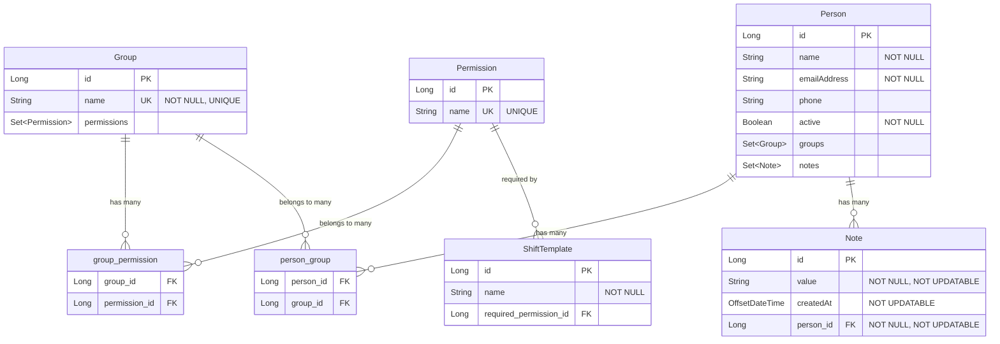

# Entity Relationship Diagram

This document contains a Mermaid diagram showing the database entities and their relationships in the BSCMail4 application.

## Entity Diagram

## Entity Descriptions

### Group
Represents a group of volunteers. Groups can have multiple permissions and can contain multiple people.

- **Table Name**: `groupp` (note: "Group" is a reserved SQL word)
- **Key Attributes**: 
  - `name`: Unique group identifier
  - `permissions`: Set of permissions associated with this group

### Note
Represents a note attached to a volunteer (Person). Notes are immutable once created.

- **Key Attributes**:
  - `value`: The note content
  - `createdAt`: Timestamp when the note was created
  - `person`: The volunteer this note belongs to

### Permission
Represents a specific permission that can be granted to groups.

- **Key Attributes**:
  - `name`: Unique permission identifier

### Person
Represents a volunteer in the system.

- **Key Attributes**:
  - `name`: Volunteer's name
  - `emailAddress`: Contact email
  - `phone`: Contact phone number
  - `active`: Whether the volunteer is currently active
  - `groups`: Groups the volunteer belongs to
  - `notes`: Notes about the volunteer
  - `getPermissions()`: Derived method that returns all permissions from the volunteer's groups

### ShiftTemplate
Represents a template for creating shifts, which may require specific permissions.

- **Key Attributes**:
  - `name`: Template name
  - `requiredPermission`: Optional permission required for this shift type

## Relationships

1. **Group ↔ Permission**: Many-to-many relationship via `group_permission` junction table
2. **Person ↔ Group**: Many-to-many relationship via `person_group` junction table  
3. **Person → Note**: One-to-many relationship (a person can have many notes)
4. **Permission → ShiftTemplate**: One-to-many relationship (a permission can be required by multiple shift templates)